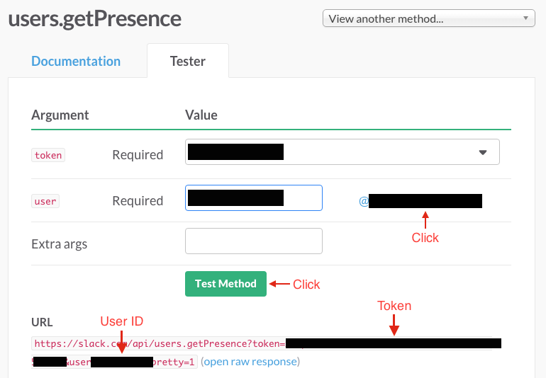
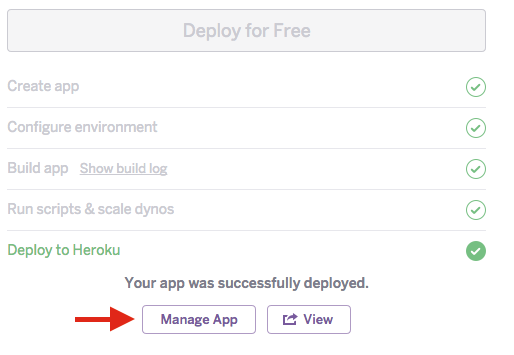

ethanifier for android
======================

Ethanifier is an application that allows anyone to see your presence in Slack and message you


### Getting Started

Fork or clone the repository

```
git clone https://github.com/juliangarritano/ethanifier-android.git
```

Sign up for a free app token on [SupportKit.io](https://app.supportkit.io)

Set up a Slack integration in the app you just created (this is how you'll talk to people)

Open the project you just cloned in Android Studio (Open an existing Android Studio project)

Copy and paste the app token into the `EthanifierApplication.java` file in the Ethanifier project. 
You'll want to replace the token in the init call with your own token.

### Slack Presence

This flavour of Ethanifier includes Slack presence, so your users can see if you're online or not.

To set this up, you'll need a secure web app to store your Slack credentials

Worry not! I've created a button that will automatically deploy a copy of this application to Heroku for you at the click of a button

To find your Slack credentials, go [here](https://api.slack.com/methods/users.getPresence/test)

Click on your @username, and press Test Method

You will want to note the token and user generated in the URL Slack provides.



To deploy your web app, click this handy button below

[](https://heroku.com/deploy?template=https://github.com/juliangarritano/ethanifier-server)

Once you've created an account and deployed your application, you'll want to configure it with your Slack credentials

Click on the Manage App button



Go to Settings and click Reveal Config Variables

Create two configuration variables, SLACK_USER_ID and SLACK_AUTH_TOKEN

Paste the credentials that were generated from Slack above.


That's it! You now have your very own web application.

### Finishing touches

Copy your heroku app domain (located in the settings screen, should be something like [your_app_name].herokuapp.com)

In `MainActivity.java` of the Android application, paste your domain name in the apiEndpoint variable:

`private final String apiEndpoint = "https://ethanifier.herokuapp.com";`

That's it! You should now have your very own copy of Ethanifier working. Give it a try.

### Adding push notifications and more features

Take a look at the [SupportKit docs](http://docs.supportkit.io) to learn more about the library I used to implement the messaging functionality. It contains many more features that are really handy for any app you might be working on.